# GamerHouse – Technical Document 

## Project Overview

GamerHouse is a REST-based backend system that allows users to **maintain a private, personalized gaming library**. Authenticated users can track games they are playing, wish to play, or have completed, along with progress details such as hours played, personal ratings, and notes.

The system is designed to be **simple, secure, and user-centric**, following Django and Django REST Framework best practices. All gaming data is owned by individual users and is not shared publicly.

## Problem Statement

Gamers often play multiple games across platforms and struggle to keep track of their progress and preferences. Existing solutions are either public or unnecessarily complex.

There is a need for a **simple, authenticated REST API** that enables users to:

* Maintain a personal list of games
* Track game status and progress
* Store gaming metadata securely
* Perform CRUD operations on their own gaming data

## Objectives

* Implement a complete user authentication flow
* Enable CRUD operations for user-owned gaming content
* Use Enums, Constants, and Environment Variables
* Enforce strict user-level data isolation
* Follow clean Django project and app structuring

## Scope of the Project

* User registration and authentication (JWT)
* Role-based access control (Admin, Gamer)
* User-owned game management
* Game progress and status tracking
* Admin-managed reference data (genres, platforms)

## User Roles and Permissions

#### Gamer

* Register and authenticate
* Create, read, update, and delete **their own games**
* Track:
    * Status (Wishlist, Playing, Completed, Dropped)
    * Platform played
    * Hours played
    * Personal rating
    * Notes
* Cannot access other users’ data

#### Admin

* View and manage user accounts
* Soft delete or deactivate users
* Manage system-defined genres and platforms
* Does **not** manage or modify user game entries
* Admin users cannot be deleted via any API endpoint.

### Permission Matrix

| Action / Resource         |      Gamer     |        Admin        |
| ------------------------- | :------------: | :-----------------: |
| Register / Login          |        ✔       |          ✔          |
| View own profile          |        ✔       |          ✔          |
| Update own profile        |        ✔       |          ✔          |
| Delete own account        |        ✔       |    ✖ *(blocked)*    |
| View other users          |        ✖       |          ✔          |
| Update other users        |        ✖       |          ✔          |
| Delete other users        |        ✖       | ✔ *(except admins)* |
| View all games            |        ✖       |          ✔          |
| Create / Edit Games       | ✔ *(own only)* |          ✖          |
| View Genres / Platforms   |        ✔       |          ✔          |
| Manage Genres / Platforms |        ✖       |          ✔          |


## Technology Stack

* **Backend Framework:** Django, Django REST Framework
* **Authentication:** JWT (Access & Refresh tokens)
* **Database:** PostgreSQL 
* **ORM:** Django ORM


## Module Breakdown

#### Users Module

* Custom user model based on `AbstractUser`
* Role stored as enum (`ADMIN`, `GAMER`)
* Authentication and authorization logic
* Soft deletion for auditability


#### Games Module

* Stores **user-owned games**
* Each game belongs to exactly one user
* Tracks game progress and metadata

Tracked fields include:

* Game title
* Platform played (FK → platforms)
* Genre (FK → genres)
* Status (enum)
* Hours played
* Personal rating
* Notes
* Completion timestamp

#### Genres Module

* Stores predefined game genres
* Managed only by admin users
* Used as reference data for user games
* Prevents magic strings and duplication

#### Platforms Module

* Stores predefined gaming platforms (PC, PlayStation, Xbox, etc.)
* Managed only by admin users
* Used as reference data for user games
* Prevents magic strings and inconsistent platform values


## Database Design



The database uses a **normalized relational design** with a clear separation between:

* User data
* User-owned gaming content
* Reference data (genres, platforms)

#### Key Design Principles

* All games are owned by users
* No shared or global game catalog
* Enums are used for constrained values
* Soft deletion is used where appropriate

## Entities

#### Users

* Stores application users (admins and gamers)
* Role stored as enum (`ADMIN`, `GAMER`)
* Supports soft deletion


#### Games

* Represents a user’s personal game entry
* Linked to exactly one user
* Contains progress-specific data


#### Genres

* System-managed reference data
* Selected by users when creating games
* Not user-editable


#### Platforms

* System-managed reference data
* Selected by users when creating games
* Not user-editable


## Enums

#### Game Status

* `WISHLIST`
* `PLAYING`
* `COMPLETED`
* `DROPPED`


## Indexes & Constraints

* `users.email` – UNIQUE
* `users.username` – UNIQUE
* `genres.name` – UNIQUE
* `platforms.name` – UNIQUE
* `games(user_id, status)` - Optimizes user-scoped game queries with status filtering
* `games.created_at` - Supports default ordering and paginated listing
* Foreign key constraints enforced across all relations
* Enum validation enforced via model field choices and serializer validation


## API Design

#### Base Configuration

* **Base URL:** `/api/v1/`
* **API Versioning:** URI-based (`v1`)
* **Authentication:** JWT (Access & Refresh tokens)
* **Pagination:**
    * Applied to all list endpoints
    * Default page size: **10**
* **Update Strategy:**
    * `PATCH` used for partial updates
    * `PUT` is not used


#### Filtering & Query Parameters

Filtering is supported on list endpoints where applicable. Multiple filter values are supported using comma-separated parameters.

**Games - Supported filters:**

| Filter       | Description                           |
| ------------ | ------------------------------------- |
| `search`     | Case-insensitive match on game title  |
| `status`     | Comma-separated list of game statuses |
| `genre`      | Comma-separated genre UUIDs           |
| `platform`   | Comma-separated platform UUIDs        |
| `min_rating` | Minimum personal rating (integer)     |
| `min_hours`  | Minimum hours played (integer)        |


**Behavior notes:**
- All filters are optional; missing parameters are ignored.
- Comma-separated values are split, trimmed, and applied using `__in`.
- Invalid values return an empty list (no errors raised)


Examples:

```
GET /games?status=playing&platform_id=550e8400-e29b-41d4-a716-446655440000

```
```
GET /api/v1/games/?status=completed,playing
GET /api/v1/games/?genre={uuid},{uuid}
GET /api/v1/games/?platform={uuid}
GET /api/v1/games/?min_rating=4
GET /api/v1/games/?min_hours=10
GET /api/v1/games/?status=completed&min_rating=4
```
#### Summary (quick reference)

| Filter       | Example                                                          |
| ------------ | ---------------------------------------------------------------- |
| status       | `?status=completed,playing`                                      |
| genre        | `?genre=1,2`                                                     |
| platform     | `?platform=3,4`                                                  |
| min_rating   | `?min_rating=4`                                                  |
| min_hours    | `?min_hours=20`                                                  |
| all combined | `?status=completed&genre=1&platform=2&min_rating=4&min_hours=30` |


#### Authentication

```
POST /auth/register
POST /auth/login
POST /auth/refresh
POST /auth/logout
```

#### Admin User Management APIs

```
GET    /users
GET    /users/{id}
PATCH  /users/{id}
DELETE /users/{id}
```

#### Authenticated User APIs

```
GET    /users/me
PATCH  /users/me
POST   /users/me/change-password
DELETE /users/me
```

#### User Game APIs

```
GET    /games
POST   /games
GET    /games/{id}
PATCH  /games/{id}
DELETE /games/{id}
```

* All game APIs are scoped to the authenticated user
* Users cannot access or modify other users’ games


#### Genre APIs

```
GET    /genres          (all users)
POST   /genres          (admin only)
GET    /genres/{id} 
PATCH  /genres/{id}     (admin only)
```

#### Platform APIs

```
GET   /platforms (all users)
POST  /platforms (admin only)
GET   /platforms/{id} 
PATCH /platforms/{id} (admin only)
```


## Authentication & Authorization Strategy

* JWT-based authentication
* Short-lived access tokens with refresh tokens
* Role-based permission checks
* Object-level permissions for user-owned data
* Unauthorized access returns appropriate HTTP errors


## Conclusion

GamerHouse is designed as a **secure, simple, and user-focused backend system** that directly aligns with the project PRD. The architecture prioritizes correctness, clarity, and maintainability while demonstrating strong fundamentals in Django, Django REST Framework, authentication, authorization, and RESTful API design.

